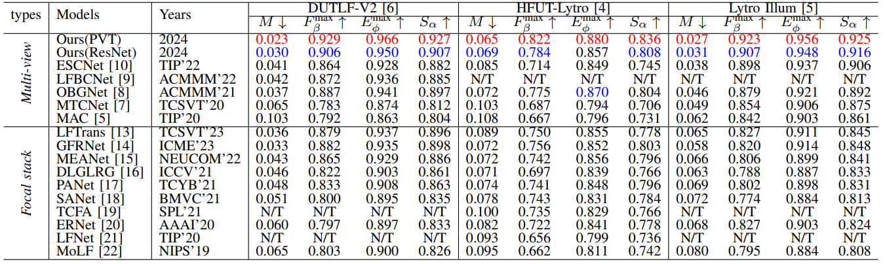

# PANet
Official code repository for paper **Parallax-Aware Network for Light Field Salient Object Detection** ([SPL2024](https://ieeexplore.ieee.org/document/10461057)).

## Overall Architecture
<p align="center">
     <br />
 <em> 
     Overall architecture of the proposed PANet.
    </em>
</p>

<p align="center">
     <br />
 <em> 
     Details of the Parallax Processing Module (PPM).
    </em>
</p>


## Inference
Download the pretrained model at [Baidu Driver](https://pan.baidu.com/s/1n0TT-R5oqmk4lZ_K9d0rGw) (PSW: xmhu).

Generate saliency maps:
- Run `python test.py`


## Results
<p align="center">
     <br />
 <em> 
     Quantitative Results. “N/T” denotes unavailable results. ↑/↓ means that a larger/smaller value is better. The top two results are highlighted in <font color="red">red</font> and <font color="blue">blue</font>, respectively.
    </em>
</p>

 ### Download
The saliency maps can be download from [Baidu Driver](https://pan.baidu.com/s/1D5Jqr7ql9ZPcV_tAshRYgg) (PSW: 1iuf).

## Citation
Please cite the following paper if you use this repository in your research:
```
@article{yuan2024parallax,
  title={Parallax-Aware Network for Light Field Salient Object Detection},
  author={Yuan, Bo and Jiang, Yao and Fu, Keren and Zhao, Qijun},
  journal={IEEE Signal Processing Letters},
  year={2024},
  publisher={IEEE}
}
```
Any questions regarding this work can contact yuanboera@qq.com.
